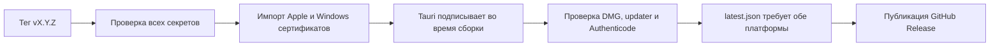

# Целостность публичного релиза PeekNook

> RepoBase выбран источником истины для кода. Упоминания GitHub ниже относятся только к временному native-build/public-download мосту на период миграции; границы переноса описаны в `PEEKNOOK-REPOBASE-MIGRATION-RU.md`.

## Что было не так — простыми словами

У приложения есть два разных вида подписи:

1. **Подпись обновления Tauri** доказывает уже установленному PeekNook, что файл обновления создан владельцем его приватного updater-ключа.
2. **Подпись операционной системы** сообщает macOS или Windows, кто выпустил приложение, и снижает предупреждения Gatekeeper/SmartScreen.

В релизе `v0.2.7` updater-файлы имели подпись Tauri, но macOS и Windows установщики были опубликованы без платформенной подписи. Это подтверждает [лог прежнего release-run](https://github.com/Linx72/peeknook/actions/runs/28289302664): runner не нашёл Apple identity, назвал приложение unsigned и пропустил Windows signing, после чего workflow продолжил публикацию.

Кроме того, старый порядок пытался подписать свободную `PeekNook.app` и Windows installer **после** создания DMG, updater-архива и `.sig`. Такая поздняя операция не исправляет уже упакованную копию приложения, а изменение Windows EXE после расчёта `.sig` делает updater-подпись недействительной.

## Как теперь работает публичный релиз

Если отсутствует хотя бы один обязательный секрет или версия в теге не совпадает с `tauri.conf.json`, tag-build останавливается до тяжёлой сборки. Пустая подпись или отсутствие macOS/Windows updater-файла также блокирует `latest.json` и публикацию. Локальный tag-скрипт дополнительно запрещает релиз из dirty checkout, чтобы проверенный код и код внутри тега были одним и тем же деревом.

Для macOS сертификат импортируется во временную CI-связку ключей. Tauri получает Developer ID identity и Apple credentials до сборки, поэтому подписывает, отправляет на notarization и упаковывает уже правильную `.app`. После сборки проверяются:

- свободная `.app`;
- приложение внутри DMG;
- приложение внутри updater-архива;
- Developer ID chain, Gatekeeper assessment и вложенный notarization ticket;
- наличие `.app.tar.gz.sig`.

Такой порядок соответствует [официальной инструкции Tauri для macOS](https://v2.tauri.app/distribute/sign/macos/).

Для Windows PFX импортируется в хранилище сертификатов до запуска Tauri. В временную Tauri-конфигурацию добавляются thumbprint, SHA-256 и timestamp server. После сборки каждый `.exe`/`.msi` должен иметь валидную Authenticode-подпись, а updater EXE — непустой `.sig`. Это соответствует [официальной инструкции Tauri для Windows](https://v2.tauri.app/distribute/sign/windows/).

После работы временные сертификаты удаляются с runner.

## Какие секреты нужны

Общие для updater:

- `TAURI_SIGNING_PRIVATE_KEY`;
- `TAURI_SIGNING_PRIVATE_KEY_PASSWORD`.

macOS:

- `APPLE_CERTIFICATE` — Developer ID Application `.p12` в Base64;
- `APPLE_CERTIFICATE_PASSWORD`;
- `KEYCHAIN_PASSWORD`;
- `APPLE_ID`;
- `APPLE_PASSWORD` — app-specific password;
- `APPLE_TEAM_ID`.

Windows:

- `WINDOWS_CERTIFICATE` — code-signing `.pfx` в Base64;
- `WINDOWS_CERTIFICATE_PASSWORD`;
- `WINDOWS_SIGNING_TIMESTAMP_URL` — необязательный URL; по умолчанию используется DigiCert.

Значения секретов нельзя сохранять в репозиторий, логи или командную строку.

## Что разрешено без сертификатов

Ручной запуск workflow на обычной ветке остаётся QA-режимом: он может собрать неподписанные артефакты для внутренней проверки, но job публикации запускается только для тега `v*`.

Локальный `peeknook-local-release.sh` по умолчанию требует настоящую подпись и notarization. Флаг `PEEKNOOK_ALLOW_UNSIGNED_LOCAL_RELEASE=1` предназначен только для явно непубликуемой QA-сборки. Скрипт публикации принудительно отключает этот обход.

Для Windows существует второй, независимый путь: MSIX можно отправить в Microsoft Store без собственного сертификата, после сертификации пакет подпишет Microsoft. Это не делает безопасными или публикуемыми обычные EXE/MSI и не снимает требования Apple к публичному macOS-релизу. Текущий Store workflow создаёт только QA-пакет с синтетической identity; границы и owner-gates описаны в `PEEKNOOK-WINDOWS-STORE-RU.md`.

## Что ещё требует реальных внешних проверок

Код не создаёт и не подменяет сертификаты. Владелец проекта должен добавить собственные Apple и Windows credentials в GitHub Secrets. После этого нужен новый тестовый tag-run на настоящих macOS/Windows runner и проверка скачанных финальных установщиков.

Старый публичный `v0.2.7` автоматически не исправляется: его установщики остаются теми файлами, которые были опубликованы в июне 2026 года. Их замена или выпуск новой версии — отдельное осознанное действие владельца.
